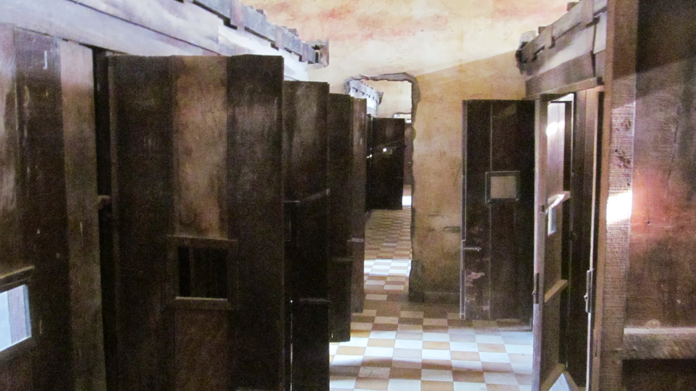

Après ces quelques jours avec Kim, le 1er avril je prends la direction de Phnom Penh, la capitale du Cambodge. Je suis accueillis par Stéphane, un expate français qui travaille dans une association nommée passerelle numérique. Cette association a été créée par un Télécomien il y a quelques années. Elle offre aux jeunes de milieux sociaux défavorisés une formation en informatique, un domaine porteur où les salaires sont élevés. Stéphane rencontre les entreprises pour comprendre quel est leur besoin et arrange le programme de la formation en fonction de cela. Grâce à cette façon de procéder, les jeunes acquièrent des compétences recherchées par les entreprises et 100% de la promotion trouve un travail à la sortie de l'école.

  Ce soir, c'est vin et saucisson ! La vie est belle !

Mais Phnom Penh est surtout l'occasion pour moi d'en apprendre davantage sur l'histoire récente du pays : le génocide cambodgien qui s'est produit sous le régime de Pol Pot entre 1975 et 1979.

### Petit rappel historique

Pour les courageux, voici un petit résumé de cet événement qui, je pense, est méconnu en France… Dans nos livres d'histoire, on nous parle énormément des 6 millions de juifs abattus pendant la 2ème guerre mondiale mais très peu des 1,7 millions de Cambodgiens (1/3 de la population) exécutés sous l'Angkar.

Ce résumé est un assemblage de passages d'un livre racontant l'histoire d'une ONG française : Enfants du Mékong ; une ONG qui s'est développée à cette époque pour secourir les réfugiés Cambodgiens qui quittaient le pays mais aussi les Vietnamiens et Laotiens qui fuyaient leur régime communiste.

> En 1975, au Cambodge, la victoire du parti communiste, dirigé en apparence par Norodom Sihanouk, est saluée par la presse européenne, notamment française. En réalité, ce sont les communistes radicaux, **les Khmers rouges**, qui prennent Phnom Penh. Le **17 avril**, lorsqu'ils entrent dans la capitale, la population, croyant à la libération communiste, les accueille dans la liesse. Deux jours plus tard, tous les habitants de la ville sont violemment expulsés par les soldats.

> Les Khmers rouges croient en "l'homme nouveau", un être sain élevé loin des villes gangrenées par le vice. Forts de leurs convictions, **ils conduisent toute la population à la campagne** où ils l'obligent à travailler la terre. Ils purifient le peuple par le meurtre ; l'un des génocides le plus sanglant de l'Histoire commence.

Pol Pot en 1978

> Les camps de réfugiés se remplissent de manière dramatique. La première vague de Cambodgiens politiquement compromis et menacés d'exécution est très vite suivie de centaines d'autres. Les Chinois et les Vietnamiens, apeurés par les discours du Parti prônant la "race khmère pure", préfèrent quitter leur pays d'adoption.

> Quand aux Cambodgiens, confrontés aux horreurs de l'**Angkar, l'organisation communiste Khmère**, ils comprennent vite qu'il n'y a pas de salut pour eux dans leur pays. Déportés massivement hors des villes parce qu'il faut épurer le peuple de tous les "vices urbains", de la corruption, de la prostitution, de l'influence des étrangers, ils se retrouvent dans les camps où ils sont mis au travail.

> Les travaux forcés, le paludisme, la dysenterie et la malnutrition tuent des milliers d'hommes et de femmes, **la propriété privée et l'argent sont abolis, les marchés, les écoles et les monastères sont supprimés**. **Pour l'Angkar, la conversion du Khmer en "homme nouveau" passe par le "déracinement des trois montagnes : famille, religion et hiérarchie sociale". Les familles sont séparés. Les moines bouddhistes, garants de la tradition religieuse, considérés comme dangereux, sont persécutés.**

> Les objectifs des communistes cambodgiens sont de "créer une société collective, égalitaire et rurale, assurer l'autarcie économique et l'indépendance totale du pays" et ce, quel qu'en soit le prix. Des familles tentent de fuir. Celles qui sont rattrapées, qui trahissent le régime, sont exécutées. D'autres réussissent à passer la frontière et arrivent, épuisées, dans les camps thaïlandais.

> Là, ils commencent à témoigner des violences que les "libérateurs" font subir aux populations "émancipées". "Si l'on vient vous chercher la nuit, c'est pour vous conduire à une mort certaine. Partir le matin est signe de bonheur, la nuit, de malheur", "j'espérais mourir rapidement. Je n'avais plus d'espoir de vivre. Je ne souhaitais plus voir vivre mes enfants". Personne ne les croit.

> Une fois dans les camps, les familles attendent en espérant obtenir un visa tant attendu pour la France, l'Australie ou les Etats-Unis. Mais les pays d'accueil ont des quotas.

> Le temps passe et la situation s'aggrave. En Asie, les révolutions imposent très vite des bouleversements dans la mentalité des populations.

> L'Angkar enrôle les enfants, les "graines pures" pour bâtir une nouvelle société. Les jeunes sont ainsi séparés de leurs familles, nourris de slogans révolutionnaires et éduqués dans un esprit de vengeance. Très vite, ils se métamorphosent en bourreaux, traitant avec mépris et insolence les adultes, allant même jusqu'à leur voler la nourriture. Des enfants sans aucune instruction sont promus médecins et chargés de soigner les malades. La société khmère est bouleversée, elle qui proclamait le respect des aînés comme une valeur suprême, voilà que ses enfants font la loi et foulent aux pied l'ordre social.

> Mais la révolution va toujours plus loin : elle se déclare ennemie du plaisir. Le sexe ne doit en aucun cas détourner la population de l'œuvre sacrée qui est de transformer le pays en "paradis socialiste". Ainsi, les jeunes sont-ils dressés à une sexualité qui se borne à la procréation. Par ailleurs, comme il faut renouveler la population, remplacer tous ceux qui meurent d'épuisement ou de maladie et donner naissance à une race pure, le Parti organise des unions entre Khmers d'élite. Des "rencontres" sont imposées aux femmes en fonction de leur période de fécondation. Après ce service rendu au pays, chacun peut retourner travailler.

> Des meetings et des réunions obligatoires se chargent de rééduquer le peuple à la "vérité". Et la population ,minée à la terreur, la faim et les maladies n'a d'autres choix que d'accepter ces bouleversements.

> Depuis fin 1977, les relations entre le Cambodge et le Viêt-Nam sont extrêmement tendues. En décembre 1977, le Viêt-Nam pénètre en territoire cambodgien. La guerre pourrait encore être évitée mais, un an plus tard, après une série de menaces, de pressions, de ruptures diplômatiques, l'armée populaire vitnamienne franchie à nouveau le Mékong et marche sur Phnom Penh. Le **7 janvier 1979, la capitale tombe, c'est la fin du Kampuchéa démocratique au Cambodge, la fin de l'Angkar** (Le régime khmer rouge tombe en 1979 au Cambodge. Rappelons pourtant que les Khmers rouges seront les seules autorités reconnues par les instances internationales jusqu'en 1993. "C'est l'ambassadeur khmer rouge Thiounn Prasith qui va conserver, pendant les 14 années qui suivent, le siège du Cambodge à l'ONU. Les bourreaux représentent leurs victimes, alors même que, dans les zones encore sous leur contrôle, ils continuent de massacrer les populations. Pour Washington, les principaux dirigeants de l'ex-Kampuchéa démocratique sont considérés comme "des personnalités non communistes" qu'il faut soutenir dans leur lutte contre l'occupation vietnamienne." Le Monde diplomatique, octobre 2006). **Pol Pot**, le "frère numéro un", fuit vers l'ouest avec la plupart des cadres khmers rouges.

> **En 4 ans, les khmers rouges ont supprimés un tiers de la population cambodgienne sans que le monde ne veuille s'en rendre compte.**

> A leur place, les Vietnamiens installent des communistes formés à leur école, d'anciens Khmers rouges rescapés des purges de l'Angkar. Hauts cadres du parti communiste cambodgien pendant un temps, ces hommes avaient dû fuir au Viet-Nam, parce qu'ils n'étaient pas assez radicaux orthodoxes. Le parti communiste vietnamien, le Lao Dông, les a accueillis, formés et replacés à la tête du Cambodge. L'un d'entre eux, Hun Sen, ancien Khmer rouge reconverti à la doctrine vietnamienne, est encore au pouvoir aujourd'hui.

> Les mouvements de populations deviennent considérables. Des milliers de familles désespérées, qu'elles soient communistes ou affiliées au régime khmer rouge, fuient vers l'ouest et tentent d'entrer en Thaïlande. La situation devient dramatique. Le gouvernement thaïlandais, déjà débordé par les réfugiés qu'il accueille sur son territoire depuis 1975, décide de fermer sa frontière aux Cambodgiens, interdiction qui sera suivie d'expulsions. Même les khmers qui avaient réussi, entre 1975 et 1979, à se réfugier dans les camps thaïlandais sont reconduits au Cambodge. Seuls quelques privilégiés, acceptés de justesse dans un pays d'accueil, échappent à l'horreur.

> La population cambodgienne se retrouve prise entre deux feux. A l'est, les Thaïlandais la repoussent de force dans son pays. A l'ouest, les Vietnamiens et la fin du délire khmers rouge la condamnent à l'exode. Des centaines de milliers de Cambodgiens s'agglutinent le long de la frontière, otages de politiques qui les dépassent, abandonnés un temps par des organismes internationaux impuissants. Ils se nourrissent de feuilles et de racines.

> Beaucoup, exténués par la longue marche qu'ils viennent de faire, affaiblis par la faim et les maladies, mourront dans ces forêts. Beaucoup sauteront sur les mines disposées le long de la frontière par l'Angkar. Pendant les années de terreur, c'était le moyen le plus simple de fermer le pays et d'éviter les fuites. Les cadavres ne sont pas enterrés et pourrissent sur place. Et puis il y a les conflits, luttes violentes entre les derniers noyaux de combattants khmers rouges et les Vietnamiens, ou règlements de comptes entre pro et anticommunistes.

> En fermant ses frontières aux Cambodgiens, la Thaïlande veut signifier son refus de supporter seule le problème des réfugiés. Depuis 1975, ceux-ci doivent transiter par des camps dans l'espoir de rejoindre un pays d'accueil : les Etats-Unis, la France, le Canada, l'Australie… En vérité, l'obtention de visas pour les pays développés est soumise à des critères rigoureux et toutes les familles ne peuvent être accueillies en Occident. Nombreuses sont celles qui resteront des années dans les camps avant d'être renvoyées dans leur pays d'origine.

> L'issue de cette tragédie et le sort de milliers de victimes dépendent donc des politiques d'immigration des pays développés et des conflits diplomatiques opposant les pays de premier asile - comme la Thaïlande - aux pays tiers - comme la France.

> Le drame de cette population prisonnière finit par trouver une issue. Les médias alertent l'opinion publique. La solidarité internationale se réveille. Des pays comme les Etats-Unis ou la France promettent d'élargir leur quota d'accueil.

> Enfin la Thaïlande accepte d'ouvrir à nouveau ses frontières aux Cambodgiens. Aux camps où vivent des réfugiés vietnamiens ou laotiens viennent s'ajouter des camps khmers (qui fuient l'armée vietnamienne).

Extraits de _Enfants du Mékong, la force du don_

### Visite de S-21

A Phnom Penh, il est possible de visiter un haut lieu de cette période : S-21. Il s'agit d'une école qui a été transformée part les Khmers rouges en lieu de détention, de torture et d'exécution entre 1975 et 1979.
Entre 16 000 et 20 000 personnes auraient été exécutés en ce lieu. On peut ainsi aller d'une pièce à l'autre, où rien n'a été déplacé depuis la libération du lieu. Des photos de tous les détenus sont affichés. L'ambiance est assez morbide…
Les personnes détenues à S-21 étaient des cadres du Parti soupçonnés d'espionnage ou de simple citoyens d'énoncés par leur voisin…

Dans les anciennes salles de classe de S-21

### Le procès des Khmers rouges

Ce n'est qu'aujourd'hui que les responsables de ce génocide sont jugés. Pourquoi ? Car une guerre civile a suivit le régime de Pol Pot jusqu'en 1998. Depuis 1998, le gouvernement Cambodgien et l'ONU ont oeuvré à la mise en place d'un nouveau type de tribunal mixte, à la fois national et international. La définition des modalités de mise en place de ce nouveau modèle de tribunal a nécessité un certain temps.

En 2010, le premier accusé a été reconnu coupable ; c'était le directeur de S-21 : Kaing Guek Eav, alias Duch. Il a été reconnu coupable de crimes contre l'humanité et de violations graves des conventions de Genève de 1949. A l'audience à laquelle j'ai assisté, il était présent en tant que témoin. C'est assez perturbant d'avoir à quelques mètres devant soi quelqu'un qui a torturé, tué… et qui est calmement assis sur une chaise, pleinement conscient des atrocités qu'il a commis.

Dutch, l'ancien directeur de S-21

L'audience est publique mais peu de gens sont là : quelques occidentaux, surement des journalistes ou la famille des victimes (des occidentaux ont été arrêtés pour espionnage) et de nombreux lycéens. Mais aucun autre Cambodgien. A plusieurs reprises j'ai compris que les Cambodgiens ne s'intéressaient pas à ce procès. Le sujet est tabou, personne ne veut se rappeler les mauvais souvenirs. Il faut dire qu'avec 1/3 de la population Cambodgienne exterminée, tout le monde a souffert de la perte d'un membre de la famille.

  Au procès des Khmers rouges - beaucoup d'étudiants sont dans le public

Les acteurs du tribunal s'expriment dans leur langue et des traducteurs traduisent en khmer, français et anglais. Tous portent des casques audios pour entendre leur traduction. Les visiteurs ont aussi le droit à un casque.

J'assiste donc à une audience du deuxième dossier de ce procès : celui des 3 dirigeants du régime Khmers rouges (Pol Pot est mort en 1998) : Nuon Cheaa, Xhieu Samphan et Ieng Sary. J'ai beaucoup de chance car au cours de cette audience, Duch raconte beaucoup d'anecdotes et de faits historiques ; j'arrive bien à suivre après mes lectures sur le sujet.

Duch explique qu'il était responsable de récolter les aveux à S-21. Il n'hésite pas à employer les mots qu'il faut pour décrire certaines situations. L'avocat de la partie civile (les victimes du régime de Pol Pot) questionne particulièrement sur 4 prisonniers étrangers et sur la façon dont s'est produit leur interrogatoire ; qui écrivait leurs aveux ; à qui les aveux étaient retransmis au niveau supérieur (il n'a pas voulu répondre à cette question). On lui présente un document nommé "le dernier plan conjoint" et on lui demande d'expliquer le titre ; on l'interroge sur le déplacement des populations vers les campagnes ; on cherche à savoir à quel point ce déplacement de population était organisé et le processus que suivaient les déportés ; à quelle condition les citoyens étaient considérés comme espions ; on l'interroge sur un document du Parti qui explique que le sentiment d'amour est mauvais pour le développement de la société, les dénonciations au sein de la famille…

Bref, les thèmes sont nombreux et le témoignage replonge l'auditoire dans l'histoire. Mais les choses ne vont pas vites. Duch est souvent imprécis, et il faut un peu de temps entre chaque question/réponse pour que les traducteurs traduisent. Le temps est chronométré pour rester dans les temps. Alors qu'il faudrait des années de témoignage pour tout comprendre, les avocats de la partie civile n'ont que quelques heures. Je comprends beaucoup mieux la lenteur de la justice. Le travail d'écoute est énorme.

Assisté à ce procès a été passionnant. C'était un vrai cours d'histoire - c'est aussi l'histoire qui tire un trait sur cet horrible évènement.

Pour contraster un peu, je pars ensuite pour les plages de sable blanc du Cambodge. Je vais y faire une petite pause dans une fabrique de papier avant de prendre la route du Vietnam.
