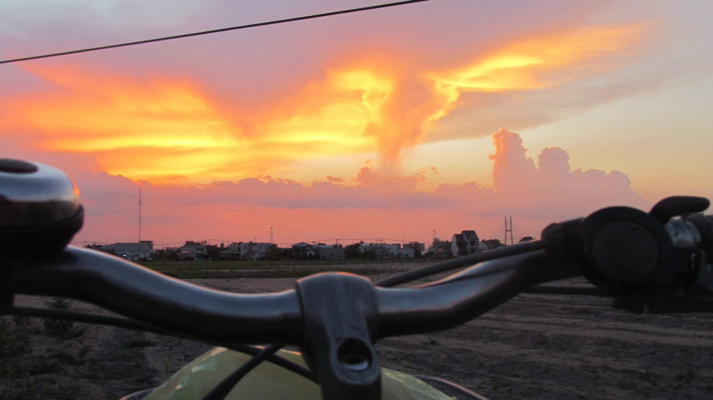

Couché de soleil pendant ma traversée du Vietnam

### Rencontre d'Alex

Après avoir passé une semaine à Sihanoukville, dans une fabrique de papier, je quitte le Cambodge, le 14 avril, en direction du Vietnam.

Sur la route, je rencontre Alex, un Russe qui tente de faire du stop, comme moi, pour quitter Kampot. Nous allons dans la même direction et allons donc faire un petit bout de chemin ensemble. Rapidement, un conducteur de camion s'arrête pour nous. Dans le camion, Alex me raconte tous ses bons plans pour voyager dans la région, cela fait cinq mois qu'il voyage en Asie. Il m'explique qu'il dort dans les temples, les astuces pour être pris en stop, il me montre son petit papier plastifié avec écrit "gratuit" dans toutes les langues asiatiques !

C'est trop rigolo ! J'ai l'impression de m'entendre parler. C'est bien la première fois au cours du voyage que je rencontre quelqu'un qui voyage comme on l'a fait avec Olivier. Habituellement, j'ai du mal à être compris par les voyageurs quand je dis que je ne dors pas dans les hôtels et que je ne vais pas prendre le bus. On me conseille des hôtels "super sympa", mais ces conseils sont "à côté de la plaque" car ça ne correspond pas à mon mode de voyage. Là, pas de problème, je suis très bien compris et nous nous échangeons de nombreux bons plans.

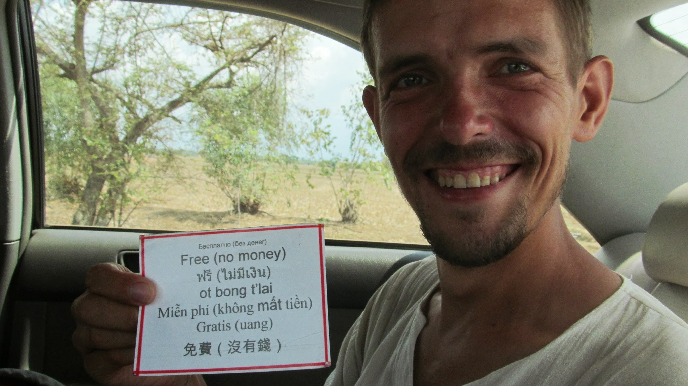

  Alex et son papier magique : le mot gratuit écrit dans toutes les langues !

Alex aussi va au Vietnam mais il ne va y passer que 15 jours avant d'aller en Chine puis rentrer en Russie, en stop. Je compte y passer un mois. De plus, je pense acheter un vélo à mon arrivée au Vietnam... nous ne continuons donc pas notre route ensemble mais ce fut une rencontre bien sympa !

### Premiers pas au Vietnam

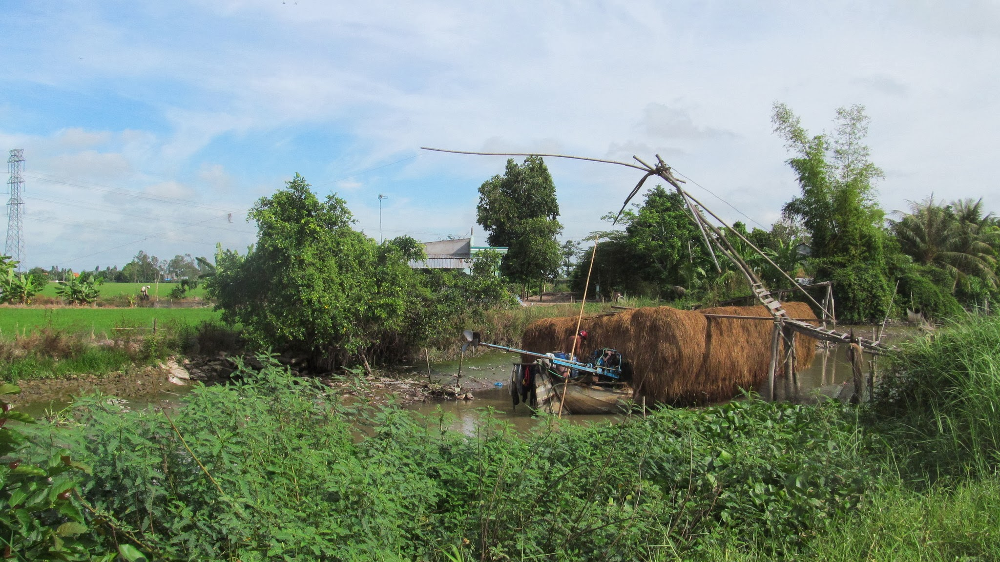

A quelques kilomètres de la frontière

Le passage de la frontière marque un changement assez net ! Alors que je quitte le Cambodge en zone rurale, 200 mètres après la frontière, je me retrouve en ville au Vietnam. La densité de population est bien plus élevée au Vietnam qu'au Cambodge et je le vois tout de suite. Je constate également la disparition totale de l'anglais : en Thaïlande et au Cambodge, je trouvais tout de même des gens qui parlaient anglais mais ici non ! Et après dix jours dans le pays, je crois que les gens ne comprennent toujours pas quand je leur dit "bonjour" : il faut bien dire "Xìn Cháo" et non "Xín Chào" ! Communiquer devient donc un vrai problème ici, même pour des choses très simples.

En revanche, les gens sont heureux de me voire passer, ils me saluent et parfois même m'invitent à boire un café. Il ne doit pas y avoir beaucoup d'occidentaux qui passent par cette frontière !

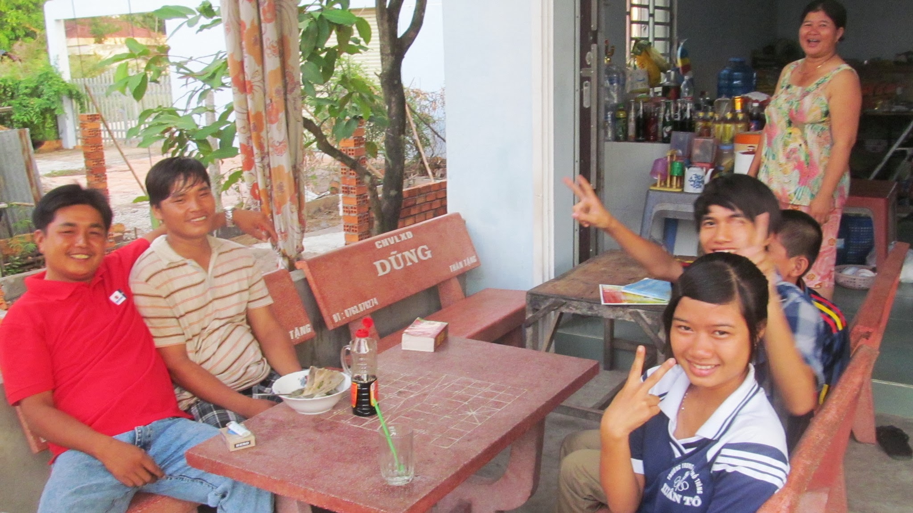

  Rencontre à quelques mètres de la frontière pour boire un café

Je commence à chercher un magasin de vélo mais cette petite ville ne semble pas en avoir un. Je me dirige donc vers la plus grosse ville du coin. Sans même lever le pouce, un monsieur s'arrête tout souriant et me propose de monter à bord de sa voiture ! Sur la route, il m'explique, avec son bon anglais (il est Cambodgien), à quel point il est heureux de vivre !! Il en oublie souvent de regarder la route !

Il m'explique également qu'étant plus jeune, il a passé 9 ans dans un camps de réfugiés situé au niveau d'une frontière thaïlandaise. Mais il aimait bien vivre là-bas. Cela lui permettait de rencontrer beaucoup de monde et d'apprendre pleins de langues... il en parle couramment 6 aujourd'hui. Il me raconte la situation précaire dans laquelle il vivait là-bas. Ça joie de vivre, même dans des situations difficiles, est impressionnante ! Un bon exemple à suivre !

### Premiers tours de pédales au Vietnam

Le lendemain, je m'équipe sans plus tarder d'un vélo et pars sur les routes du Vietnam. Je me trouve tout au sud du Vietnam. Le défi est de rejoindre Hanoi à vélo mais je ne pense pas que mon visa d'un mois me laissera suffisamment de temps pour le faire, sans parler de mon courage qui risque de faiblir en cours de route ! On verra bien jusqu'où j'irai !

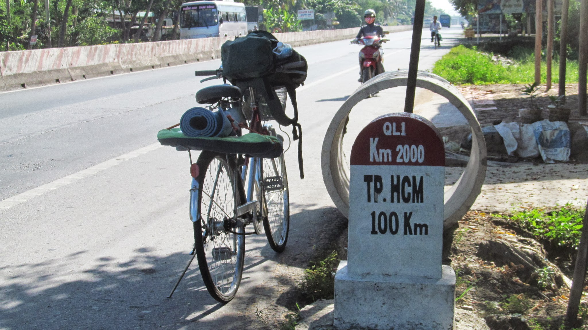

  Euuh, il y a un zéro de trop non ?.... non, 2000kms jusquà Hanoi... si je
  reste sur l'autoroute qui y va sans détours !

Au sud du Vietnam, c'est le delta du Mékong, idéal pour faire du vélo car c'est tout plat ! Malgré tout, les premiers jours de vélo ne sont pas faciles... Je fais des pauses régulières dans les innombrables "cafés ammac" qui bordent la route !

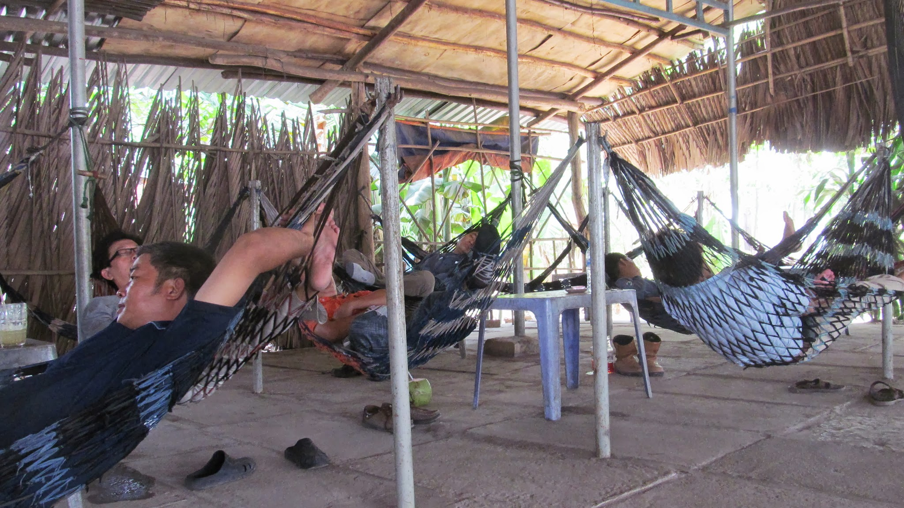

Café à ammacs !

Je m'y arrête également entre 10h et 15h car le soleil tape trop fort. autant vous dire que la vie reste belle ! La boisson locale est le jus de canne à sucre. Sur les routes, il y a un vendeur tout les 50 mètres en moyenne. En ayant perdu mon compagnons de route préféré, je perds aussi de mon courage à négocier... et je crois que je me fais un peu avoir du coup... mais bon, parfois l'arnaque est un peu grossière et le vendeur revient vite au "vrai prix".

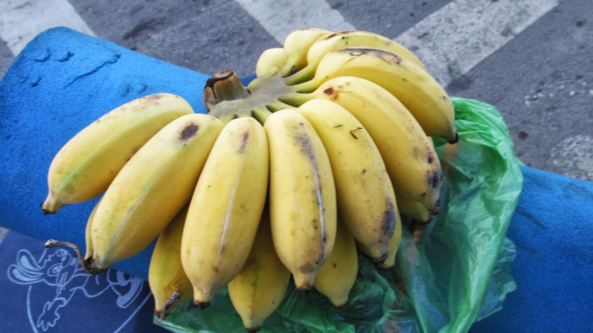

Huuuuum les bananes à 0,35eur !

Bon, le vélo, c'est fatiguant, mais c'est aussi une bonne option pour profiter des beaux paysages. La suite en image.

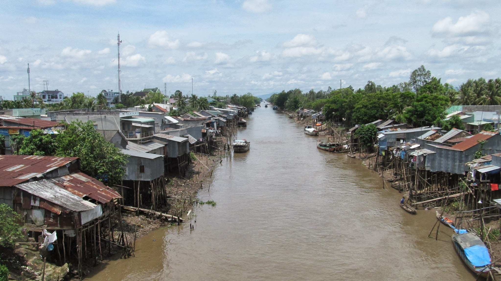

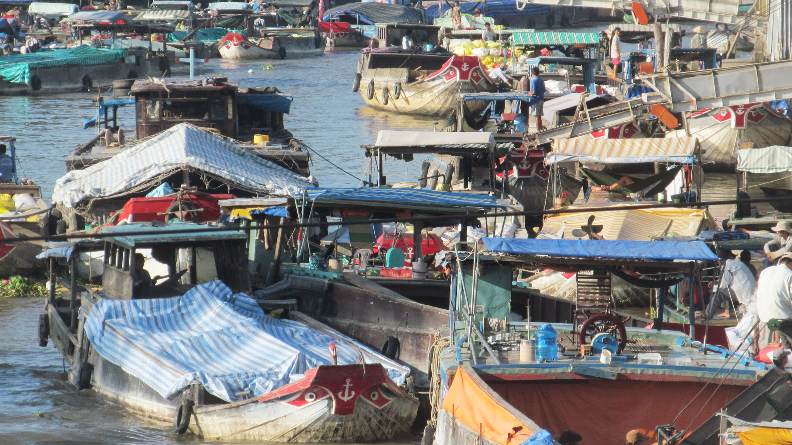

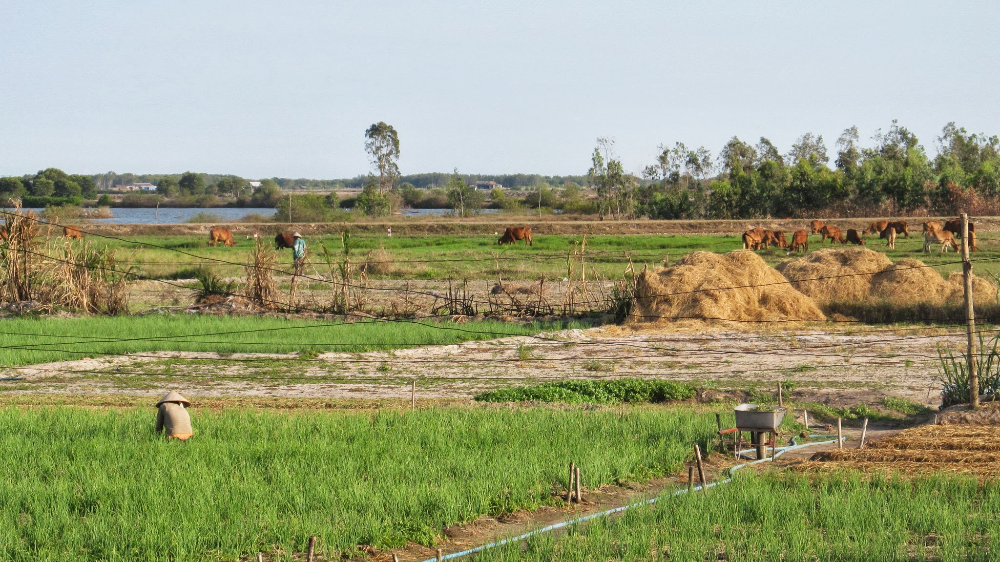

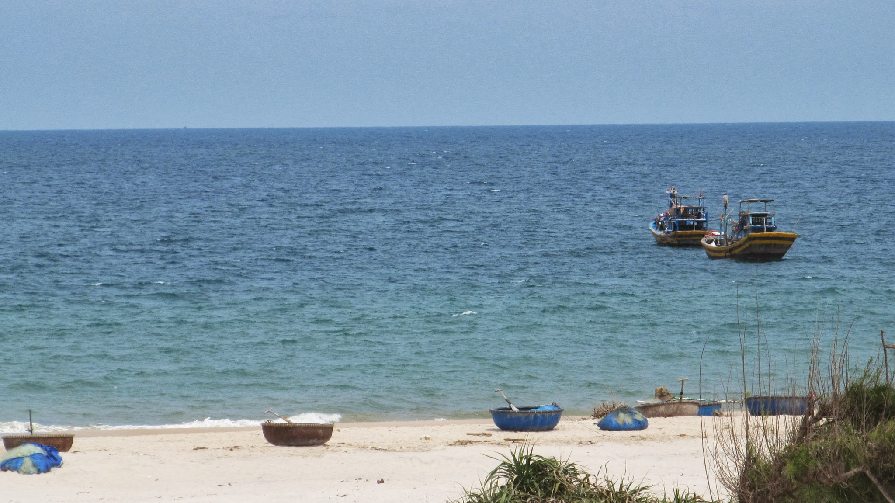

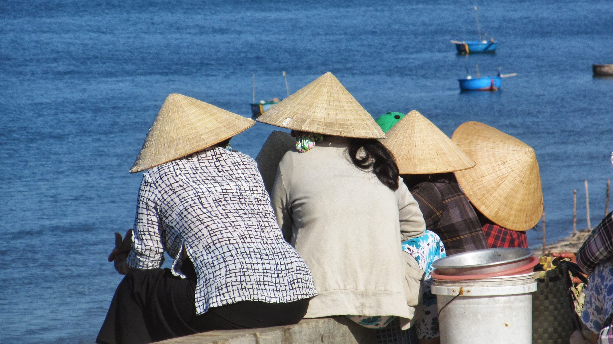

Le clan des chapeaux pointus

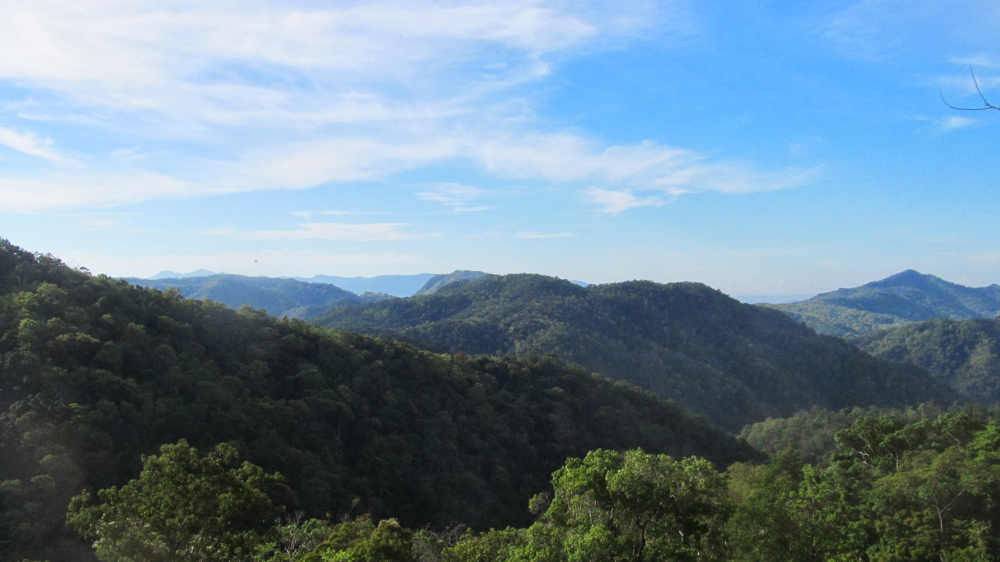

Après les 4 pires heures de ma vie !

### Rencontres entre Can Tho et Ho Chi Minh City

Lorsque je fais du vélo, les Vietnamiens sont très contents de me voir. Les enfants agitent leurs mains en criant "hello" et les adultes.... aussi ! C'est agréable mais je ne rencontre pas pour autant beaucoup de monde. De même, après de telles journées sportives, le soir, je n'ai pas vraiment le courage de chercher longtemps un endroit où dormir et je choisis souvent la solution de facilité et de confort : l'hôtel. Bref, à ce rythme là, je ne rencontre pas grand monde.

Le couche surfing me permet tout de même d'en faire un peu. Je suis très bien accueillis par Lòk à Can Tho. Il me fait visiter sa ville en moto, me fais tester les délicieux pancakes vietnamiens, m'emmène voir ses grands parents et leur ferme... Une bonne pause en ville avant de reprendre la route !

Il y a aussi des rencontres tombées du ciel ! En fin de journée, alors que j'approche de la ville dans laquelle je pense dépasse un Vietnamien à vélo... 15 secondes plus tard, il me rattrape et reste à mon niveau, sans parlé, juste avec un énorme sourire, en pédalant. Au bout d'un moment, j'engage la conversation mais il ne parle pas anglais. Finalement, il comprend que je cherche un endroit où dormir et me dépose à un hôtel. Je vais ensuite dîner. Lui repasse dans le coin et me retrouve. Il me propose d'aller faire un tour à vélo !! J'ai tout sauf envi de faire du vélo ! Finalement, je monte à l'arrière de son vélo et il m'emmène boire un verre (de canne à sucre !) et me montre les endroits qu'il aime bien. Il m'emmène notamment dans une cours de récréation où est organisé un cours d'arts martiaux. Habituellement, il participe mais pas ce soir. On se quitte devant mon hôtel... une rencontre bien sympa !

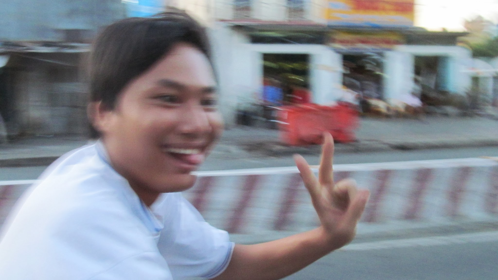

  Fin de journée, un Vietnamien me poursuit à vélo !

### La guerre du Vietnam

Je profite de mon étape à Ho Chi Minh City pour visiter le musée de la guerre du Vietnam (petit rappel des dates pour Anne-So : 1964-1975). C'est assez intéressant car c'est l'occasion de découvrir cette guerre du point de vue très différent de celui qu'on a de cette guerre en occident. Alors que je m'attendais à une présentation neutre de la guerre, le musée nous montre ce que les Américains ont pu faire de pire au cours de cette guerre sans dire un mot des atrocités qui ont du aussi avoir lieu dans le camp opposé.

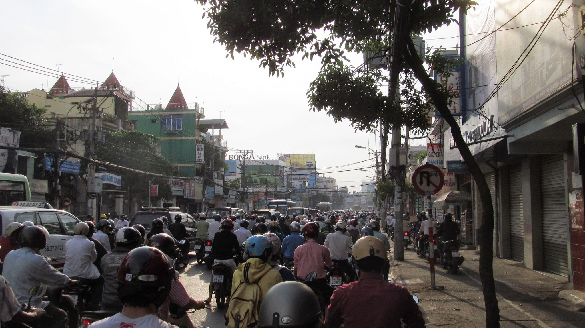

Dans les rues d'Ho Chi Minh City

Quoi qu'il en soit, en sortant de ce musée, on se dit que les Américains n'ont pas fait mieux que les nazis où les khmers rouges ! Le musée insiste lourdement sur les massacres des soldats américains et les armes chimiques qui ont été utilisées. Au cours de cette guerre, le Vietnam est devenu un laboratoire géant pour tester les dernières innovations des chimistes. Résultat, de nombreux enfants nés dans les années 1970 au Vietnam ressemblent à des pommes de terre. Oui, oui, des pommes de terre, le terme n'est pas exagéré : sans membres, sans distinction entre la tête et le tronc... bref, ce n'est pas joli à voire.

Je reprends ensuite ma route vers le nord du pays.

### Badaboum

Voilà 11 jours que je fais du vélo et... badaboum ! La roue avant de mon vélo se bloque me faisant faire de belles galipettes sur le bitume ! Résultat : deux belles plaies à la tête et à l'épaule et une entorse au poignet droit. Bon... adieu la fin du périple à vélo. Je suis bien soigné à l'hôpital du coin et je me repose quelques jours avant de repartir à pied. Mais avec mon épaule blessée, pas facile de porter mon sac. Je vais donc limiter les déplacements à pieds ! Direction Tam Ky où m'attend un Couch Surfeur, Hué, la baie d'Halong puis Hanoi avant de rejoindre le Laos.

Voilà l'itinéraire que j'ai suivi à vélo

<iframe src="http://maps.google.com/maps/ms?msa=0&msid=209305977641840145623.0004bed0932521d4605e2&hl=fr&ie=UTF8&t=m&ll=11.29955,106.74561&spn=2.56008,3.30808&output=embed"></iframe>
Afficher <a href="http://maps.google.com/maps/ms?msa=0&msid=209305977641840145623.0004bed0932521d4605e2&hl=fr&ie=UTF8&t=m&ll=11.29955,106.74561&spn=2.56008,3.30808&source=embed">
  Mon trajet à vélo au Vietnam
</a> sur une carte plus grande.

import Navigation from "../../Navigation";

<Navigation previous="/2012-04-12" next="/2012-05-14" />
