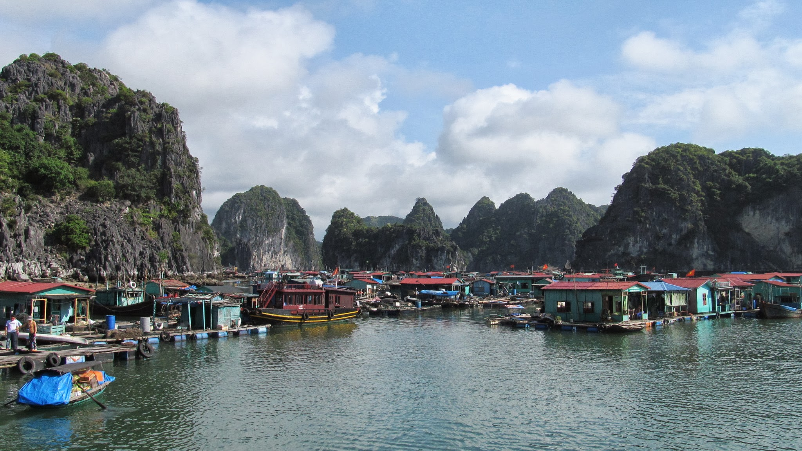

La baie d'Halong

Après quelques jours de repos à Buon Ma Thuot, je repars sur les routes du Vietnam, cette fois-ci en stop !

A vélo, je m'étais éloigné de l'axe routier principal... me voilà bien gâté pour trouver des véhicules dans ce coin un peu pommé du Vietnam.

Sur la route, pas de voiture... que des vaches

Après 3 jours de stop assez difficiles, j'arrive à Tam Ky où Tan, un nouveau Couch Surfeur Vietnamien, m'accueille. Il habite à quelques kilomètres de la ville, dans un petit hameau de campagne. L'endroit est idéal pour se reposer et rencontrer les amis de Tan.

Après-midi pêche avec Tan et son ami d'enfance

Chez Tan, il y a une cuisine, une salle pour manger et une grande pièce, lieu de vie mais aussi de culte. Ses ancêtres reposent ici. Lorsque je demande quelle religion pratiquent les personnes que je rencontre, ils me répondent souvent qu'ils sont bouddhistes. Mais la façon de pratiquer n'est pas du tout la même que dans les pays voisins. Ici il n'y a pas de statues de Bouddha, ce sont les ancêtres qu'on prie, en particulier à certains moments, désignés par le calendrier lunaire.

Tan étudie l'anglais à l'université, et comme 100% des étudiants de sa classe, c'est pour ensuite travailler dans le milieu du tourisme. Le milieu du tourisme fait rêver tous ces étudiants que j'ai rencontrés. Pour eux, c'est l'opportunité de quitter leur mode de vie rural et de changer leur niveau social... car c'est bien connu, le tourisme, ça paye bien ! Mais je suis étonné de ne pas en rencontrer qui apprennent d'autres langues... ce serait pourtant une compétence très recherchée. Quelques étudiants de la classe de Tan veulent absolument discuter avec moi pour pratiquer leur anglais. Leur motivation est impressionnante.

Tan et moi, invités à un mariage

J'étais étonné car lors de mes recherches de Couch surfeurs, il y avait de nombreux hôtes à Tam Ky (qui est une petite ville peu touristique), tous inscris sur le site au même moment. En fait, l'un des professeurs de la classe de Tan leur en a parlé et leur a expliqué que c'était une opportunité pour leur futur travail de connaître des voyageurs partout dans le monde. J'ai l'impression que le Couch Surfing est un réseau social qui prend une ampleur énorme et même dans les pays les plus pauvres, on trouve toujours des Couch surfeurs. Le réseau apporte des intérêts très variés pour ceux qui l'utilisent. En tout cas, voilà bien longtemps que je n'ai pas rencontré un voyageur qui ne connaissait pas ce réseau social.

Tan m'invite au mariage d'une de ses amies. Dans le petit village de Tan, une grande tente a été installée pour un grand repas. Il est 10h du matin, nous sommes mercredi, et nous passons à table ! Avant de se marier, il faut consulter les astres pour trouver un jour favorable au mariage du couple, c'est pourquoi le mariage à lieu un mercredi ; et pour le 10h du matin... je ne l'explique toujours pas ! Mais même à cette heure là, le repas est absolument délicieux.

Notre table au mariage

Un karaoké a été installé pour l'occasion... j'ai du mal à entendre mon voisin tant la musique est forte. Je dois moi aussi chanter devant la centaine d'invités présents ! La fête n'est pas très glamour : tout le monde boit de la bière, beaucoup de bière ! Mais tout le monde semble bien s'amuser. Les jeunes se tournent pas mal autour ; Tan m'explique que les mariages sont l'occasion idéal pour former de nouveaux couples !

Je quitte ensuite Tan. A quelques kilomètres au nord se trouve Hoi An, un des hubs touristique du Vietnam. Sans surprise, ce ne fut pas une de mes idées les plus brillantes que de m'y rendre ! J'abandonne rapidement l'idée de trouver un hôtel bon marché là-bas. Mais même planter la moustiquaire n'y est pas facile. Généralement, je cherche un endroit privé où la planter pour éviter les rencontres nocturnes, mais la rudeur des gens me surprend, même dans les temples je suis très mal accueilli.

Au port de Hoi An

Je finis par comprendre pourquoi. Les gens ont peur de la police. Au Vietnam, il est interdit d'héberger un étranger sans aller l'enregistrer auprès de la police. Certains des couch surfeurs qui m'avaient hébergé avaient d'ailleurs effectué la démarche. Si quelqu'un est pris en flagrant délit, il risque de lourdes peines. Bien sûr, c'est bien connu, la police passe régulièrement dans les maisons et dans les jardins pour vérifier qu'il n'y a pas d'étrangers en train de dormir ! Mais rien à faire, personne ne me laisse planter la tente. En fait les gens ont peur d'être dénoncés par leurs voisins !

Je m'installe finalement sur un terrain un peu à l'abri des regards; mais malheureusement, le propriétaire passe ! Ouf, il accepte de me laisser dormir ici et m'apporte même une bouteille d'eau. Plus tard, il revient avec toute sa famille et m'explique que tout le monde est inquiet pour moi ! Quel contraste avec les quelques rencontres que j'avais faites un peu plus tôt. Je les rassure. Mais encore un peu plus tard, un policier arrive ! Sûrement que le propriétaire a eu peur et a préféré prévenir la police. Il veut que je l'accompagne en centre-ville... Raaaaa, pour moi c'est la garantie de remarcher encore 1h dans le noir pour trouver un endroit où dormir ! A force d'insister, le policier me laisse rester ici. Il me demande mon passeport et veut voir mon portefeuille pour être sûr que j'ai de l'argent, puis me laisse dormir.

  Après une courte nuit, je quitte Hoi An en direction de Hué et la baie
  d'Halong

  A Hué, même en plein centre-ville, il y a toujours un coin tranquille où lire
  son journal

  Petit dîner entre camionneurs sur la route pour Hai Phong

Mes quelques jours de stop depuis Hoi An me mènent à Hai Phong, la troisième plus grande ville du Vietnam après Hanoi et Saigon. La ville est proche de la fameuse baie d'Halong. J'y rencontre Dan, Sud-Africain et sa copine Française, Manon. Tous les deux sont de jeunes expats. Manon travaille à Hanoi mais vient passer ses week-end ici.

J'avais déjà vu la circulation assez artistique des vietnamiens depuis les trottoirs, mais avec Dan, je la redécouvre de l'intérieur, à moto ! Nous passons notre soirée au bord du lac de la ville, puis avec les autres expats de Hai Phong.

<iframe
  style="display:block; margin:auto;"
  width="560"
  height="349"
  src="http://www.youtube.com/embed/F2Vd9lutdBA"
  frameborder="0"
  allowfullscreen
></iframe>

  Le sport favori des Vietnamiens : le Da Co... sur la vidéo, ce n'est pas très
  impressionnant mais souvent, ils échangent le volant pendant plusieurs minutes
  avec des coups qui laisserait Zidane rêveur ! Lorsque un volant arrive au
  niveau de l'épaule, les femmes lèvent leur jambe en grand écart, comme si de
  rien était pour le renvoyer...

Je prends ensuite la direction de Cat Ba, une île proche de la côte, qui est un bon point de départ pour ensuite voir la baie d'Halong... la suite en photo !

Dans les rues de Cat Ba

Au port de Cat Ba

Il y en a qui ont bien choisi leur lieu de vie !

  Les fermes de poissons dans la baie proche de Cat Ba

La baie d'Halong

Retrouvez <a target="_blanck" href="https://plus.google.com/photos/101620827917886979134/albums/5708237042176890033">toutes les photos</a> ici

Je retrouve ensuite Manon à Hanoi où elle vit avec 4 jeunes colocataires, Français. Ils sont tous venus ici grâce à un programme de la région d'île de France qui envoie pour 6 mois des modélistes/designers au Vietnam.

Hanoi

Travailler au Vietnam, c'est une autre histoire que d'y voyager ! Les expats sont confrontés à des problèmes qu'ils n'ont pas l'habitude de rencontrer en France, ça semble être une superbe expérience. Xavier, par exemple, modélise en ce moment des meubles en bois. Il doit régulièrement visiter les artisans dans leurs petits villages pour adapter ses dessins et voir comment se passe la construction des meubles. Mon premier soir à Hanoi, il téléphone pour prévenir que finalement, il doit rester au village un peu plus longtemps que prévu. Les artisans ont une perception de la relation professionnelle bien différente de celle qu'on peut avoir. En fait, pour eux, il s'agit plutôt d'une relation amicale... ils vont avoir du mal à construire un meuble pour quelqu'un qu'ils ne connaissent pas ! Xavier est donc considéré comme un invité au village... et comme tous les invités, il doit boire un coup avec les artisans... à son arrivée, à chaque repas, pour le goûter, entre chaque meuble... bref, pas facile de travailler dans ces conditions-là. Mais le plus important pour les artisans, ce n'est pas de travailler, c'est la rencontre avec Xavier.

Je prends ensuite la direction du Laos, en passant par les montagnes du nord. Tout en sachant que l'endroit est touristique, je me rends en Sapa... où je ne m'éternise pas !! La ville est connue car elle se trouve dans une région regroupant de nombreuses minorités ethniques. Et en effet, à Sapa, on voit beaucoup de Vietnamiens habillés de manière folklorique...... qui parlent parfaitement anglais et vous suivent partout pour vous vendre des souvenirs ou vous guider dans leur village, où même l'entrée est payante. Je trouve bien triste que tous ces petits villages se reposent entièrement sur le tourisme pour survivre.

Aller, en route pour le Laos !

Dien Bien, ville frontière avec le Laos

