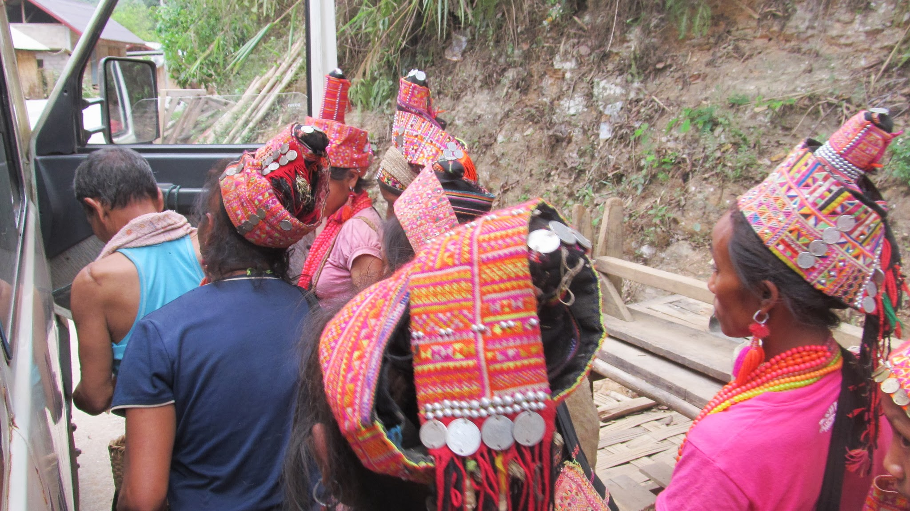
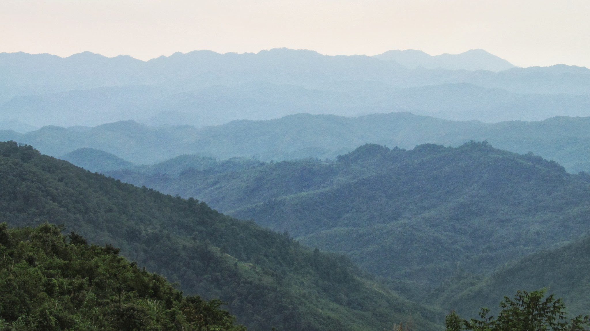
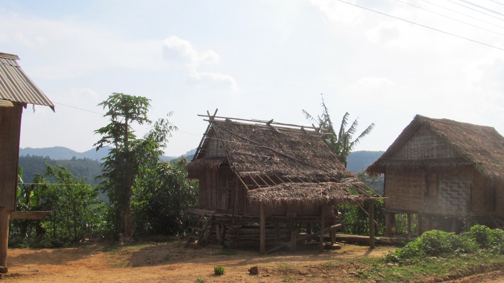
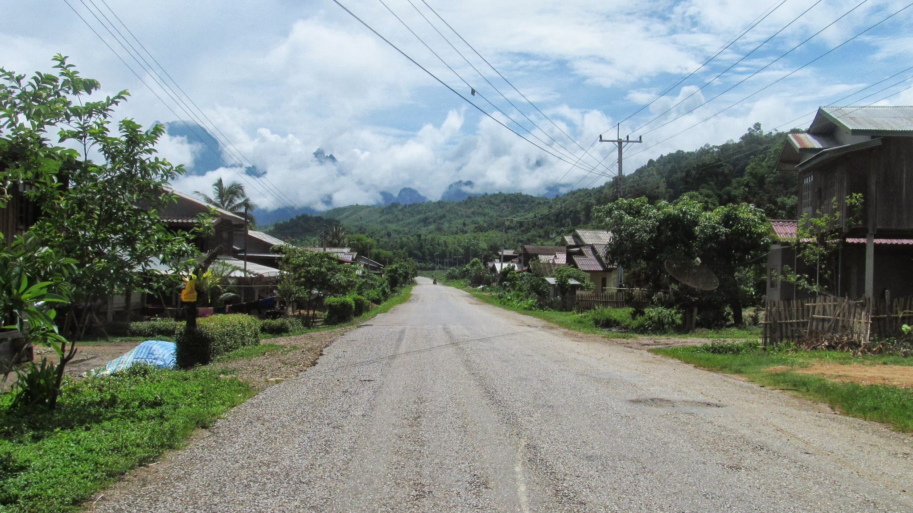
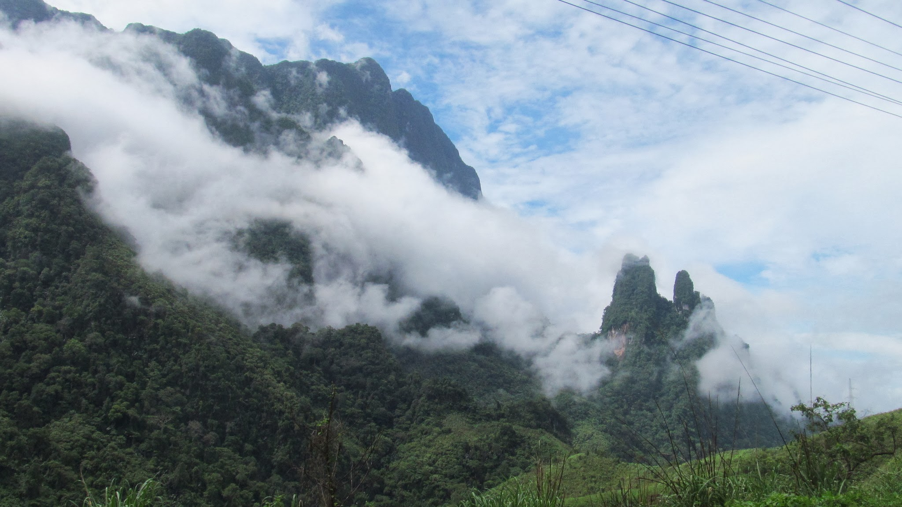
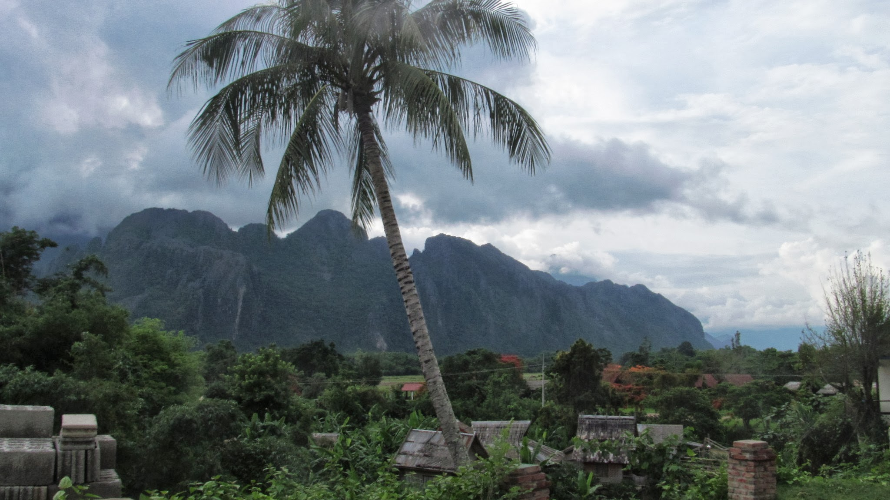
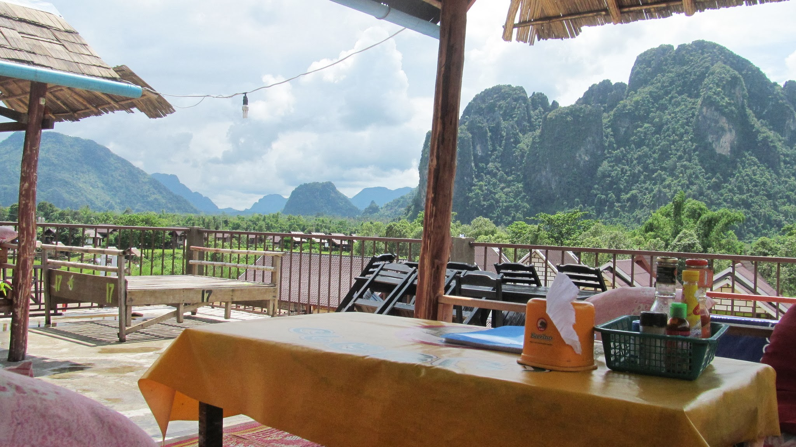
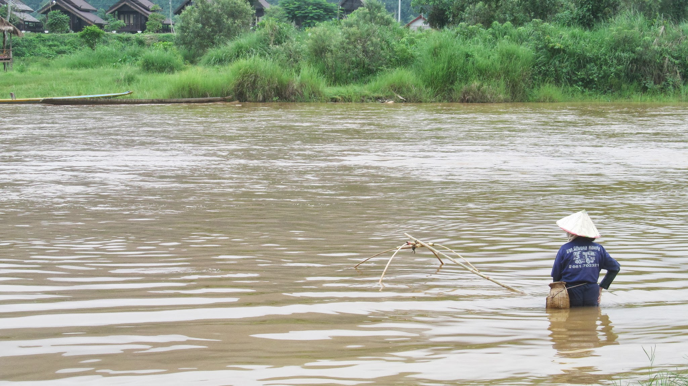
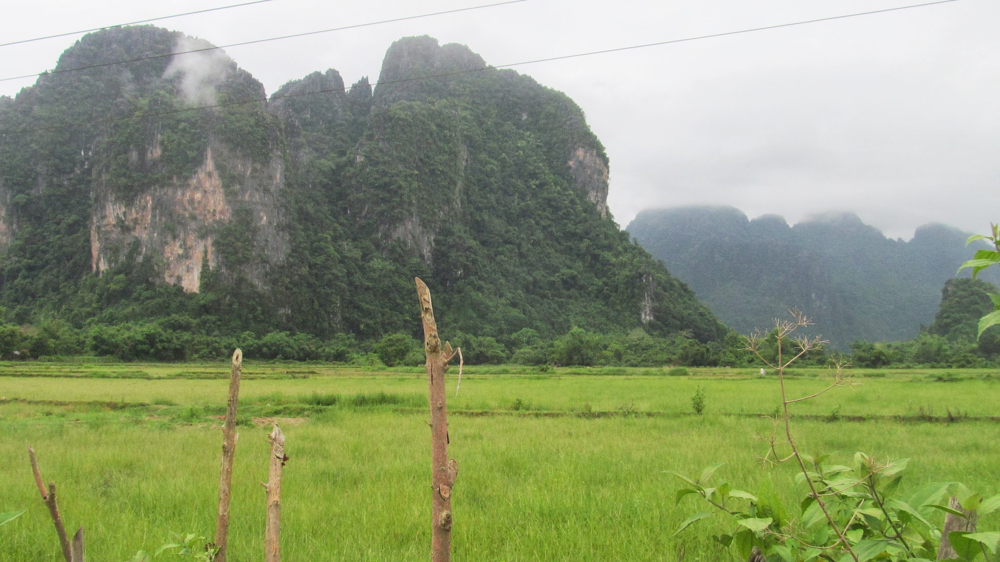

### Une nuit dans le nomads land

  Des femmes d'une minorité ethnique vendent des légumes aux passagers du bus
  dans le nord du Laos

Alors franchement... cette année, il y aura eu des frontières galères à traverser mais celle-ci, entre le Vietnam et le Laos, aura été le pompom ! Retour sur deux longues journées de galères !

Dien Bien est la dernière ville Vietnamienne avant la frontière. Il me reste une trentaine de kilomètres à faire pour rejoindre le Laos. Mais il ne semble pas y avoir grand monde qui passe par ce poste frontière. La sagesse voudrait donc que je prenne le bus du lendemain qui m'emmène à la première ville du Laos… mais bon ! Ce serait trop facile. Je commence donc à faire du stop en marchant sur la route… Après tout, il n'y a que 30kms. Quelques camions ou motos m'avancent un peu… mais seulement pour quelques kilomètres à chaque fois. J'arrive finalement à la frontière avant la nuit, épuisé (ça grimpait fort dans les montagnes), en ayant fait la plus grande partie du trajet à pied. La frontière est perdue au milieu de nul part alors que sur la carte, il était pourtant indiqué un village proche de la frontière !

  Vue depuis le poste frontière… pas de village en vu !

Habituellement, les visas se payent en dollars mais on peut aussi payer avec la monnaie locale à un taux défavorable. N'ayant pas de dollars en poche, c'est l'option vers laquelle je me tourne… mais là, le coût du visa laotien en monnaie vietnamienne est totalement inconvenable ! Je n'ai pas assez d'argent… Me voilà bien embêté ! Finalement, je réussis à changer ma monnaie vietnamienne en monnaie laotienne à un petit restaurant, ce qui me permet tout juste de payer le visa (le coût du visa en monnaie laotienne était moins élevé). Mais il se fait tard et le poste frontière ferme. Je passe donc la nuit entre le Vietnam et le Laos, sous un petit abris, avec une belle tempête.

Le lendemain, je reprends la route avec l'équivalent d'un euro en poche ! Après une matinée à marcher le long de la route, je n'ai toujours pas rencontré de véhicule, pas même le bus que la sagesse aurait pu me faire prendre. Il commence à faire faim, mais je suis au milieu de la forêt, sans personne autour du moi… Finalement, un camion finis par passer et par miracle, il s'arrête. Après une bonne heure de route, il me dépose au premier petit village du Laos. J'ai bien faim mais je préfère garder mon petit euro avec moi, au cas ou… le temps de trouver un distributeur de billets ! Je reprends donc la route mais une fois ce village passé, je me retrouve à nouveau au milieu de nul part… sans plus de passage sur la route. Quelle galère ! Après de longues heures assez désespérantes à marcher le long de la route, un véhicule s'arrête. Nous roulons encore une bonne heure jusqu'à ce qu'il s'arrête. Décidément, la première petite ville du Laos est bien loin de la frontière ! Sur la carte, elle semblait être à une cinquantaine de kilomètres de la frontière mais la route est sinueuse, et il y a en fait presque 200 kilomètres à parcourir. Je finis finalement par la rejoindre et avant même de trouver un distributeur, je passe à table !

  Pas de ville... que des petits villages en paille ou en bois !

Finalement le seul distributeur de la ville est hors service et de toute façon, il n'accepte pas les cartes VISA ! Raaaa… Il faut donc que j'aille à la grande ville suivante ! Heureusement, je trouve un bus qui part dans quelques heures et le chauffeur accepte que je paye à l'arrivée en me déposant devant une banque. Je retrouve la civilisation à la nuit tombante. Quelle journée !

### Le cycle éternel de l'autostoppeur

Le stop est un merveilleux moyen de voyager. Il permet à la fois de faire des rencontres et des économies. Ça, c'est la théorie ! Mais ça peut aussi être la galère ! Tiens, par exemple, prenons le Laos ! C'est un grand pays mais avec peu d'habitants. En plus, ils sont pauvres ! Autant dire que les voitures sont une denrée rare sur les routes. Mais ajoutez à cela le fait que les laotiens ne sont pas plein de pitié pour quelqu'un qui marche au beau milieu de la forêt, en plein cagnard et vous pouvez facilement vous retrouver à attendre plusieurs heures qu'un véhicule ne s'arrête (parfois pour seulement quelques kilomètres).

A quand le prochain véhicule ?

A lire ces lignes, vous devez surement vous dire : "le pauvre, il a eu une mauvaise expérience mais c'est une bonne leçon… il ne recommencera pas". Mais non ! Car une fois qu'on est dans le véhicule, on reprend espoir… on se dit que finalement, il y a toujours quelqu'un qui finira par s'arrêter… et alors que le véhicule s'arrête devant un bus pour vous… vous snobez le bus en disant au fond de vous même "aller, c'est reparti" tout en sachant que vous vous en mordrez les doigts dans 5 minutes… ce que vous ne manquez pas de faire 5 minutes plus tard ! Bref, c'est le cycle éternel de l'auto-stop galère.

Le stop dans le nord du Laos, n'aura donc pas été de tout repos, mais les paysages font tout de même parti des plus beaux que j'ai vu au cours de ce voyage !

  La région est montagneuse, les paysages sont magnifiques

### Repos sous la pluie à Vang Vieng

Dans le nord du Laos, il y a peu de monde. Les villes de plus de 1000 habitants sont bien éloignées et dans les villages, je ne trouve pas de restaurants ou d'endroit où je peux me reposer. De plus, il pleut tous les jours… Ce sont deux raisons qui me poussent à me poser à un endroit plutôt que d'aller à droite à gauche. Je passe ainsi 3 jours à Luang Prapang et presque une semaine à Vang Vieng, deux villes très touristiques mais où on trouve un peu de confort, idéal pour se reposer un peu.

  En ce moment, à Vang Vieng, il pleut presque tous les jours

Vang Vieng est un lieu incroyable. On oublierait presque qu'on est en Asie ! Les occidentaux s'y sont installés. Ici, les plats occidentaux coûtent moins cher qu'un plat de riz et si vous avez une petite envie de nutella, vous pouvez demander à l'un des nombreux cuisiniers sur le trottoir de vous préparer un pancake ou une crêpe banane/nutella !

Les innombrables bars se ressemblent tous et se suivent les uns à la suite des autres le long des trottoirs. Des coussins et des tables basses et un grand écran où les épisodes de Friends passent en boucle...

  La vue depuis la terrasse de mon café/resto favori

Vang Vieng longe une rivière dans une région montagneuse. Le paysage fait rêver… La grande attraction ici, c'est le tubing. Oui, alors quand on est nul en anglais, on se dit qu'on va faire un tour avec un tuba dans la rivière… d'ailleurs, on ne comprend pas bien car l'eau est trouble ! En fait, le tubing consiste à descendre la rivière sur une grosse bouée ! Et pour ajouter un peu de "fun", de nombreux bars longent la rivière et lorsque des touristes passent sur leur bouée, les barmans envoient des bouteilles à la mer, reliés à une corde… les touristes s'y accrochent et vont boire un coup au bar… et vu qu'il y a beaucoup de bar… on n'en revient pas indemne !

Pêche dans la rivière qui longe Vang Vieng

Plus tristement, Vang Vieng est aussi connu pour être l'un des seuls coins d'Asie où l'on peut faire la fête jusqu'à très tard et où l'on peut consommer toutes sorte de drogues dont l'opium, la drogue locale. Bien sur, c'est interdit mais c'est un peu la tradition ici. Malgré tout, ce n'est pas sans risques puisque la police fait de temps en temps des virées aux bars. J'entendais un groupe de touristes reparlant de leur mésaventure avec la police de la veille et des 700USD qu'ils ont chacun dû payer en amende.

La ville est néanmoins très reposante et je profite des magnifiques paysages et fait quelques balades à vélo. J'y reste ainsi presque une semaine pour m'y reposer après mon voyage au Vietnam très intense.

Petite balade à vélo proche de Vang Vieng

### Retour en Thaïlande, fin du voyage

Je retrouve ensuite la Thaïlande (en Bus !!!) après un rapide passage à Ventiane, la capitale du Laos (je devais y passer plus de temps mais mon Couch surfeur n'est jamais venu au rendez-vous que nous nous étions fixés…).

C'est un grand plaisir de retrouver ce pays où les gens sont très accueillants et où il y a beaucoup plus de voitures ;-). La Thaïlande est également beaucoup moins chère que le Laos. Je prends la direction de Chiang Mai, une belle ville du nord du pays, agréable à vivre, où nous étions déjà allé avec Olivier et Grégoire. J'y passerai un peu de temps avant de reprendre la route de Bangkok.

**Ne manquez pas le 4 juin le dernier article de ce blog : un petit retour interactif sur ces 11 mois de voyage !**
