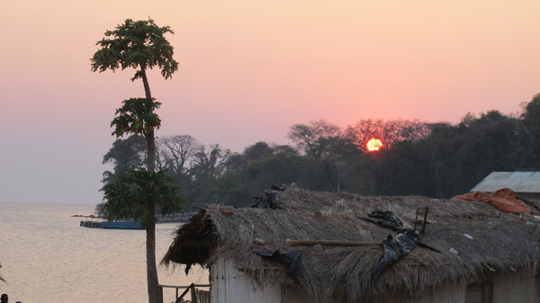
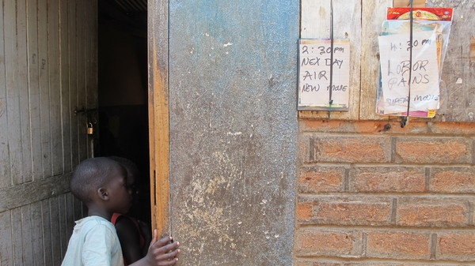
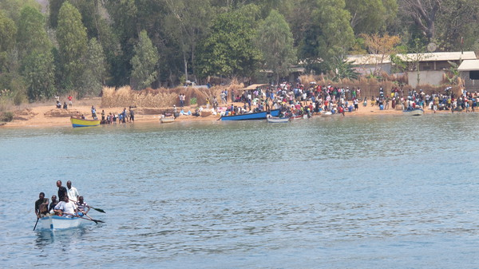

Arrivee au petit village de Mwenewenya

Oooooh ! Des blancs !

Vehicule au Malawi

Pick-up surcharge pour se rendre a Nyika

Des enfants qui courent derriere le pick-up

Premiere creuvaison

Camion a bois

Pause dejeuner au milieu de nul part

Le marche de Mzuzu

Mzuzu

Petits vendeurs au bord de la route

Nuit dans une ecole

Augustine (a gauche) et sa famille

Joshua

Recreation sur la terrasse

Mosis apres le gouter-banane !

La directrice (a gauche) avec Rebeca

Olivier cuisine Nchima

Olivia et la cuisiniere (a droite)

  Augustine et le gardien qui voulaient bien partir a notre place

Arrivee a Nkhata Bay

Attente du ferry Ilala

Mise en place du marche

Barrage de police a l'entree de Nkata Bay

Cinema [ou plutot salle-tele]

Levee du soleil sur le lac Malawi

Restaurant sur la plage

  3e classe du ferry Ilala, bousculade dans les couloirs

On me propose de la biere local sur le bateau

Bananes transportees par des voyageurs

