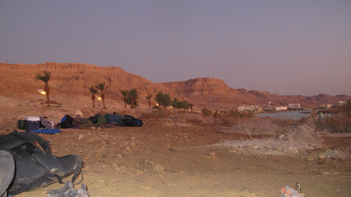
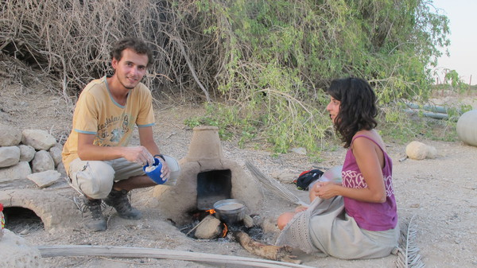
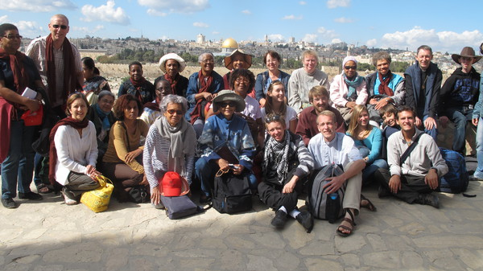
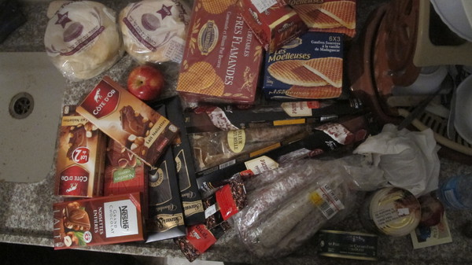
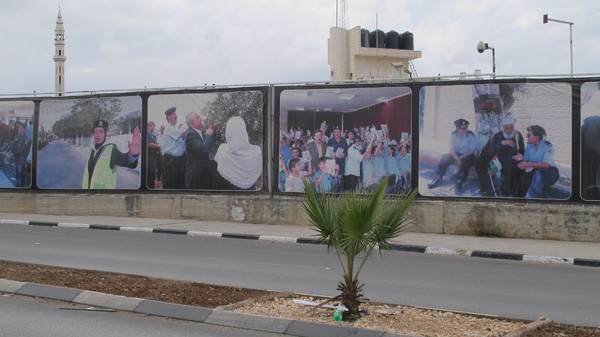

Sur la plage d'Eilat pendant Soukkot

Soiree au bord de la mer Morte

Reveil au bord de la mer Morte

  Rencontre avec des jeunes sur une plage de la mer Morte

Desert du Neguev

Preparation des chapatis avec Gal notre hote

Preparation des chapatis

Une cabane traditionnelle pendant Soukkot

  Les hauts parleurs qui annoncent la priere musulmane

Magasins de la vieille ville de Jerusalem

Dans les rues de Jerusalem

Domi Olivier et Blandine a Tel Aviv

Tel Aviv

En couch surfing chez Omer

Agriculture dans le desert du Neguev

Desert du Neguev

  Dans le desert du Neguev avec notre groupe de pelerins

La famille d'Olivier

Le mur de separation cote palestinien

Citernes d'eau sur les toits

Le dome du rocher a Jerusalem

Jerusalem

Le groupe au complet devant Jerusalem

Les parents d'Olivier devant Jerusalem

Merci pour les cadeaux

