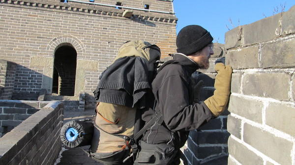
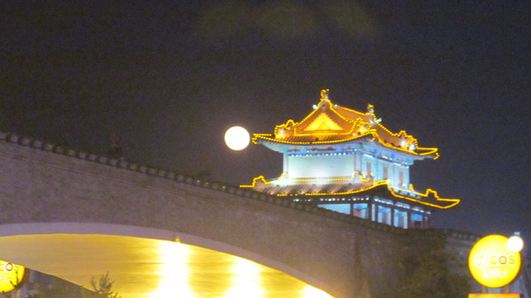
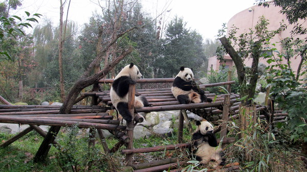

Devant le stade olympique

Un vrai chinois dans Pekin pollue

La Cite Interdite

Pagode chinoise

La colline de charbon derriere la Cite Interdite

Au restaurant chinois

Petites rues de Pekin

Dans les rues de Pekin

On a resiste a la tentation...

Les paysages sont magnifiques

  La Muraille de Chine ! [pour ceux qui n'auraient pas remarque]

Olivier devant la Grande Muraille

Couche de soleil depuis la Muraille

Troncon non touristique de la muraille

  Couche de soleil depuis une tour de garde de la muraille

Ouf, le feu a pris, nous mangerons ce soir

  Au petit matin, nos bouteilles d'eau sont gelees ainsi que nos pieds

Campement dans une tour de garde

  Rencontre insolite au pied de la Muraille avec l'homme au 2 cheveux

Un peu gluant... et pas appetissant

Finalement on nous offre le repas

L'armee en terre cuite de Xi'an

Pleine lune a Xi'an

Cerf volantiste de Chengdu

