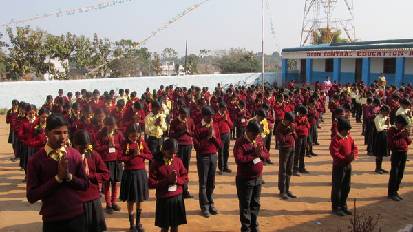
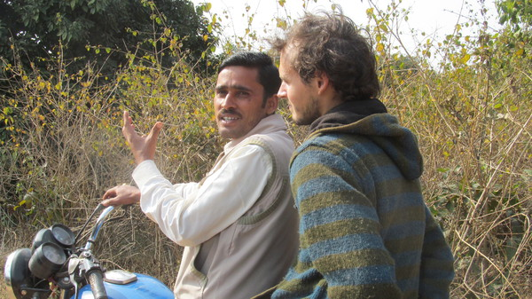

L'Inde est au bout du brouillard

Tuuuuuuuute !!!!

Fruits et legumes

Les fameux Rickshaws !

Dans un village avec le Guru en jaune

Sur le buffle

En visite dans une ecole

  Ecoliers de la banlieue de Patna que nous avons visite

Dans les rues de Patna

Lors de la fete de la republique

Sucreries indiennes, hmm !

Parade pour la fete de la Republique

Le cricket est le sport national

Olivier au milieu d'une foule de curieux

Petit dejeuner dans la rue

Temple de Shiva

La proprete en Inde, ce n'est pas encore ca

  Olivier change de compagnon de voyage le temps d'une photo

  Temple ephemere pour les trois jours de la fete des etudes

Les enfants nous suivent !

Sarshati, fete du dieu des etudes en Inde

Nicolas, suivi d'une foule

Photo a paraitre dans le journal local

Defile avec le dieu des etudes

Nicolas qui prepare le diner

Olivier sur le toit d'un bus

La rue principale d'une bourgade

Rencontre avec Madhav, le principal de l'ecole

Dejeuner Dal-Bat

Enfants qui fuient devant nos yeux

Nicolas et Madhav sur la moto

Campagne indienne

Dans un village au milieu de la foret indienne

50 enfants entasses dans l'internat de Balumath

Traite de la vache sacree

  Photo souvenir avec le responsable securite d'une ecole

  Repos dans une Guest House, toujours bien entoures

  Dans un temple a deux pas des pelleteuses d'une centrale electrique

Visite d'une centrale electrique a Chandwa

Lever de soleil sur le Gange

Brahmanes sur le bord du Gange

Ablutions matinales dans les eaux du Gange

Partie de cricket sur les bords du Gange

Les vaches, reines de Benares

Cortege de musulmans dans les rues de Benares

Axel et Aurelie, voyageurs rencontres a Benares

  Sur les bords du Gange, il y a toujours beaucoup de monde

Petit matin sur les bords du Gange

Visite d'un monument a Allahabad

Olivier se reveille a notre arrivee a Delhi

