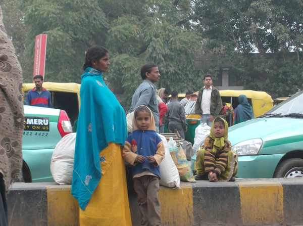
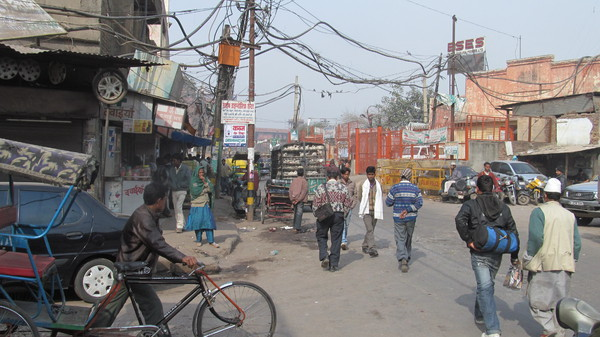
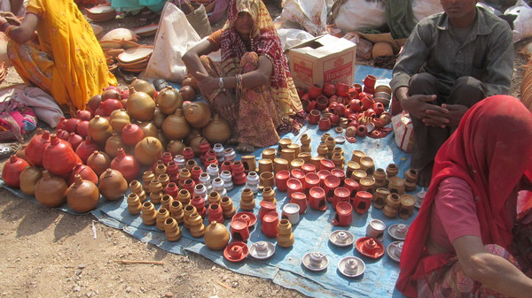

Dans les rues de Delhi

Chercher Maya l'abeille

Des grooooos paquets !

Les mecs admirent le paysage !

Seance photo avec les maries

Diner royal chez nos hotes de la banlieue de Kota

Claire-Marie se voit offrir un collier

Scene de transport !

Une vache se ballade tranquillement dans la rue

  Une armee de rickshaws, prete a tout pour nous faire embarquer

Olivier devant le fort rouge de Delhi

  A peine arrivee Claire-Marie s'entoure d'indiens curieux

Dans les rues d'Agra, cortege d'un futur marie

Leve de soleil sur le Taj Mahal

Cliche... du Taj Mahal

Le touriste du Taj Mahal

La mosque de Fathepur Sikri

  Apres une courte nuit, nous voila dans le camion safari

  Au parc de Ranthambore, les oiseaux se montrent plus que les tigres

  Des racines poussent depuis les branches de cet arbre, tentaculaire

  L'homme qui n'avait pas peur du tigre [dans le parc national]

Crocodile du parc Ranthambore

Chez nos amis rencontres dans le train

Marchand heureux comme tout de nous rencontrer

Nicolas toujours pret a acheter un ananas

  Tristan et Claire-Marie, entoures d'une foule d'admirateurs

  Au petit matin, photo de famille avant de quitter nos hotes

OLI et CLARA

Vendeuses de goyave

Bundi toute en bleu

Entree gratuite du fort de Bundi

  Parcours du combattant dans les vestiges d'une forteresse{" "}

Nature vivante

Peintures intactes du palace de Bundi

Autostopeur de Nicolas et Tristan

Etal le jour de Shivatri, grande fete religieuse

Dans les rues de Pushkar

Chacun sa monture a Jaipur

  Porter le voile n'empeche pas de mettre un casque !

La muraille d'Ambert

Sur la muraille d'Ambert

  Leve de soleil sur le palace depuis notre campement improvise

