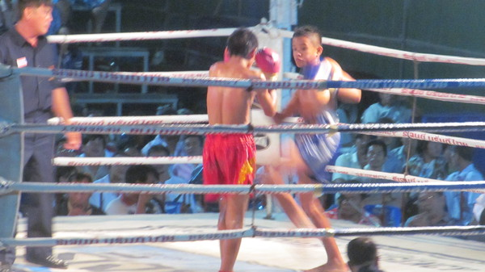
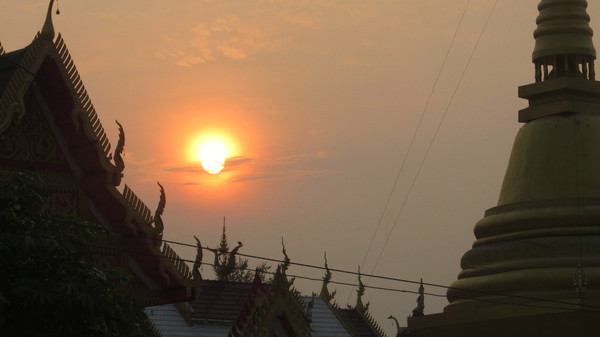

Temple d'Ayutthaya

Bouddha

Ruines d'un temple bouddhiste d'Ayutthaya

Theatre chinois a Ayutthaya

Theatre chinois a Ayutthaya

Theatre chinois a Ayutthaya

  Avec ce beau temps, pause chez le vendeur de chapeau

La Thailande ne manque pas d'elephants

Accueil dans un temple bouddhiste

Gerant d'un cyber avec ses nombreuses amulettes

  Photo avant notre depart avec Eve, notre hote de Nakhon Sawai

Ambiance de debut de soiree a Mae Sot

La boxe est le sport national

La boxe est le sport national

Bouiboui au marche de Mae Sot

Au marche de Mae Sot

  Photo de famille dans un petit parc de la region de Tak

Paysage de la region de Tak

  A l'arriere d'un pick-up nous profitons des paysages

Nicolas au plus grand barrage de Thailande

Copieuses !!!

Des moines bouddhistes

Leve de soleil a un temple bouddhiste

Petit matin à Chiang Mai

Diner exceptionnel dans un resto japonnais

Nicolas et Gregoire a Chiang Mai

